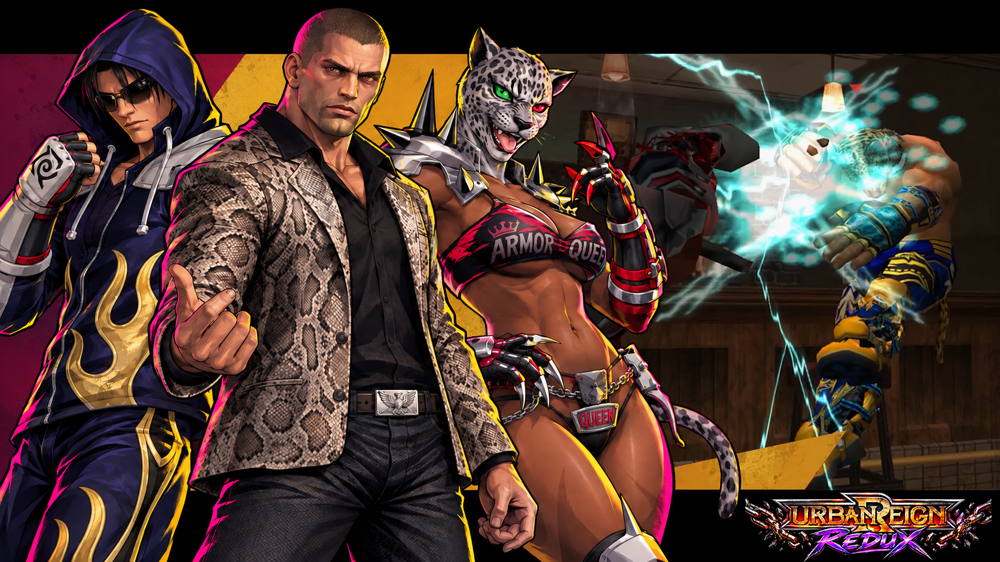
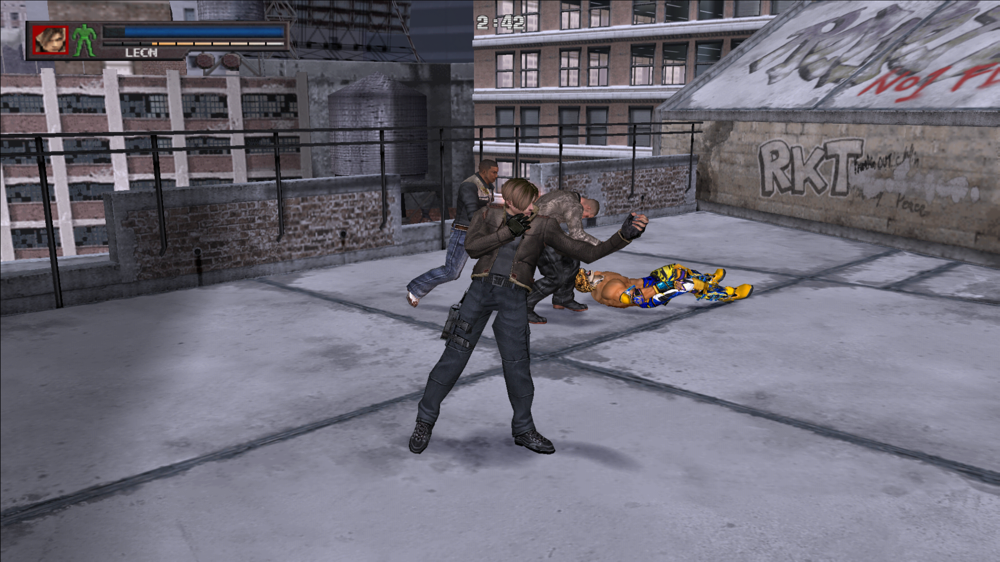
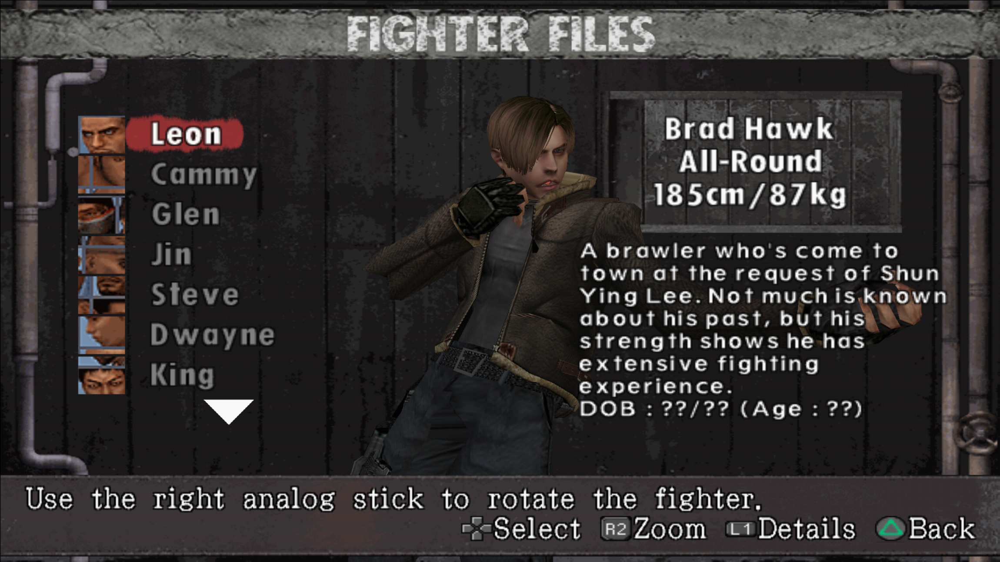
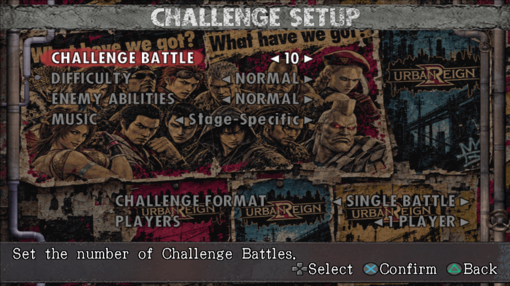

# Urban Reign Redux

A community mod project by **Jasonafex** for Urban Reign: an expanded fighter roster, additional multiplayer stages, music and menu artwork, a Windows mod launcher, and an optional editor.

**[Version 0.2 Alpha is available now.](https://github.com/Jasonafex/urban-reign-redux/releases/tag/v0.2.0)** Expanded fighter and stage selection, a mouth-animation pilot, and automatic PCSX2 companion setup. See the [changelog and known issues](CHANGELOG.md).

## Choose your setup

| Package | Use it for |
| --- | --- |
| Mod launcher + launcher mod packs | Select and apply ready-to-use mods to your own supported ISO. |
| Editor + editor-ready mods | Prepare and preview models, textures and audio; export launcher packs. |

The launcher supports **Clone** (`Name-modded.iso` beside the original) and **Overwrite**, with a recoverable original backup. **Redux Music** and **Redux UI & Intro** are separate selectable packs.

## Screenshots

The [project website](https://jasonafex.github.io/urban-reign-redux/) includes the release gallery, mod-loader and editor captures, gameplay images, and installation guide.

## Installation

1. Extract the player release with the installer and `mods` folder beside each other.
2. Run the launcher installer, then choose your supported original Urban Reign ISO.
3. Select your PCSX2 folder, then select Redux 0.2 Collection alone, choose Clone or Overwrite, and apply.
4. Open the resulting ISO in your usual game setup.

A game ISO is not included. Keep the original image or `.iso.original` backup and the `.studio.json` record to restore the original game. The editor is optional for players.

## Project status

The launcher, complete v0.2 collection, runtime setup utility and optional editor are published as a v0.2 Alpha pre-release. Violet and Marduk deformation remains a known issue. Compatibility feedback and remaining issues can be reported through GitHub Issues.

## Publishing this site

In repository Settings → Pages, choose **Deploy from a branch → main → /docs**. See [PUBLISHING.md](PUBLISHING.md) for screenshot replacement and cross-posting setup.

This repository contains the release page and publishing configuration; it does not claim to include the editor's complete source. No blanket license is granted to third-party game or character assets. Not affiliated with or endorsed by the original game's publisher.

## Version 0.2 screenshots

