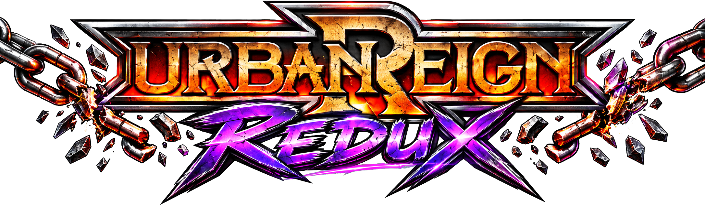
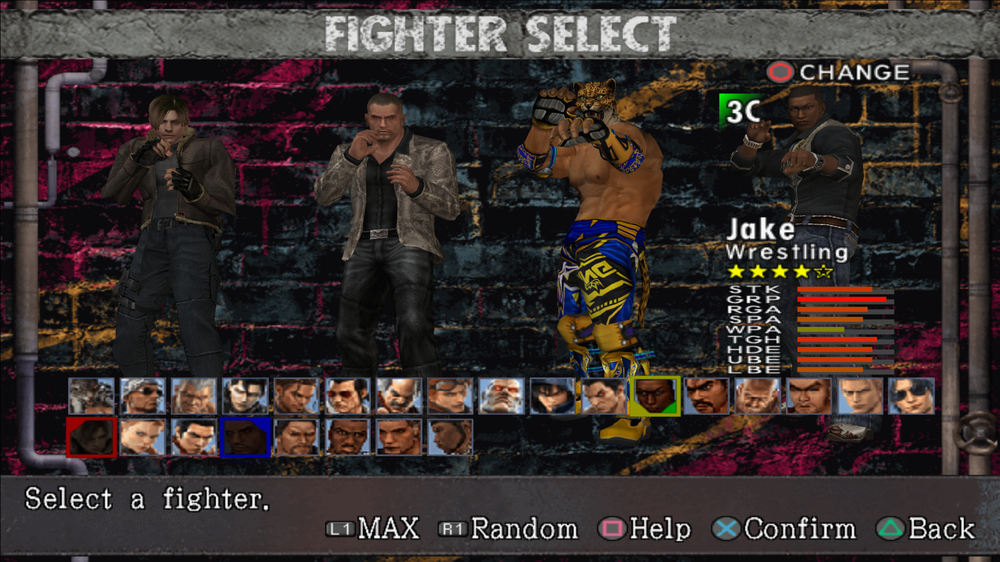
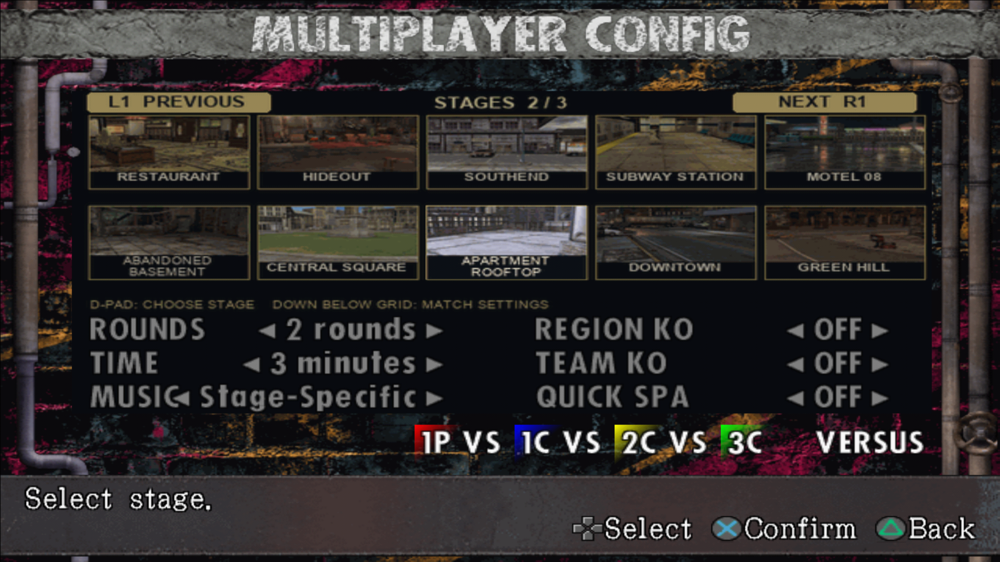

**[Click here to download Auto-Installer.exe](https://github.com/Jasonafex/urban-reign-redux/releases/latest/download/Auto-Installer.exe)** · **[Picture guide](https://jasonafex.github.io/urban-reign-redux/install/)**

# Urban Reign Redux

More fighters, more multiplayer stages, new music and menus for Urban Reign. A community project by **Jasonafex**.

## Install in three steps

1. **Download and run Auto-Installer.exe.** Keep **Mod Manager**, **Editor (Optional)** and **Mods** checked. Uncheck Editor if you only want to play.
2. **Choose your PCSX2 program folder.** Setup finds its Documents/OneDrive data folder and installs the required memory patch, runtime files and HD textures automatically. Keep PCSX2 closed during installation.
3. **Open Redux Mod Manager.** Choose your supported original Urban Reign ISO, keep **Clone** and **Redux 0.2 Collection** selected, then click **Apply selected mods**. Open the new `-modded.iso` in PCSX2 from a fresh boot.

**No ZIP extraction, separate mod downloads or manual file copying.** Desktop shortcuts are offered; starting with Windows is optional. The picture guide is included in the installer and available from Mod Manager.

You need Windows 64-bit, PCSX2 with ExtraMemory support, and your own supported Urban Reign ISO. PCSX2 and the game are not included. The release was tested with PCSX2 2.7.403. Open PCSX2 once and close it before running setup.

## See what is included

[Explore the screenshots and full project rundown](https://jasonafex.github.io/urban-reign-redux/) · [Changes and known issues](CHANGELOG.md) · [Report an issue](https://github.com/Jasonafex/urban-reign-redux/issues)

Version **0.2 Alpha** includes the expanded roster and stages, camera/HUD improvements, and a mouth-animation pilot for Leon, Cammy and Violet. Violet's shirt/gloves and Marduk's waist/underarms still have deformation issues. See the changelog for the complete list.

The optional Editor is for creating or changing mods. Players only need Mod Manager and Mods.

This repository hosts the release, website and setup support. It does not include the editor's complete source. No blanket license is granted to third-party game or character assets. Not affiliated with or endorsed by the original game's publisher.
