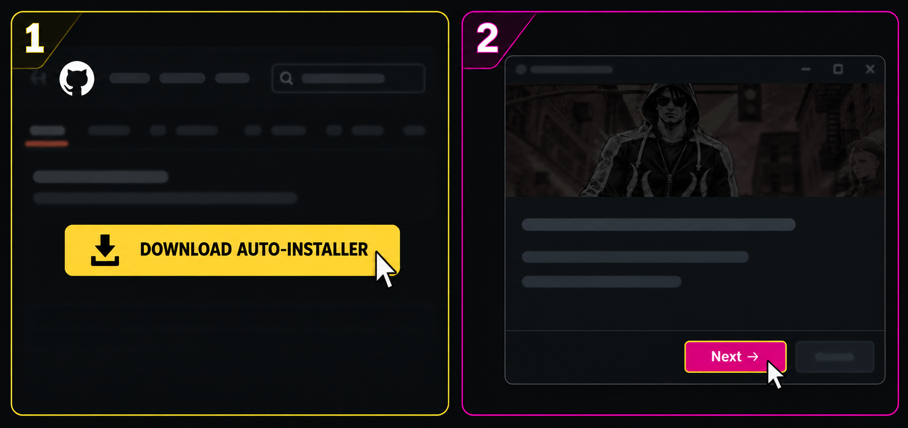
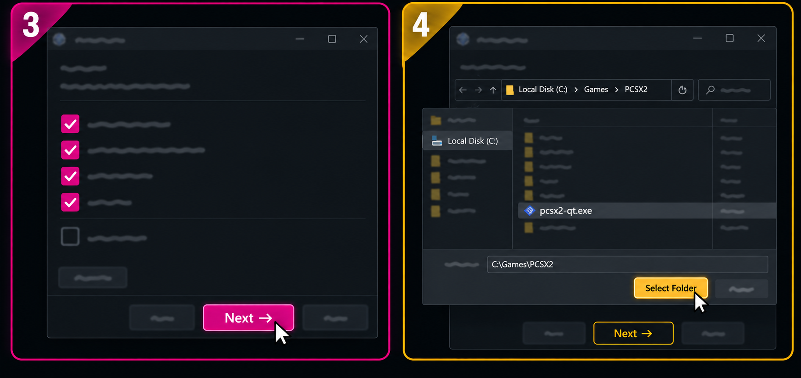
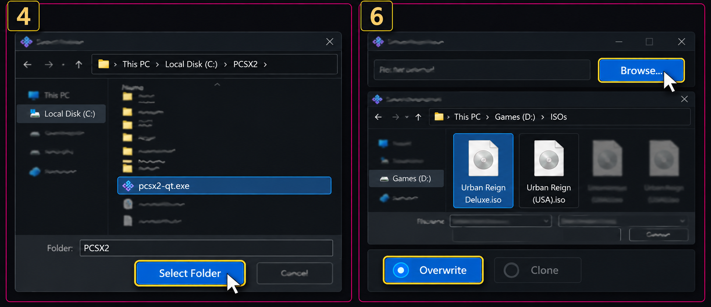
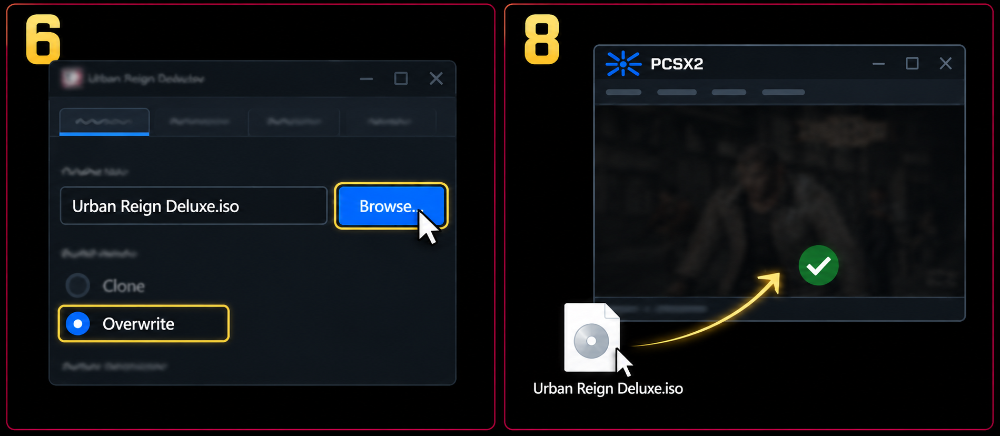
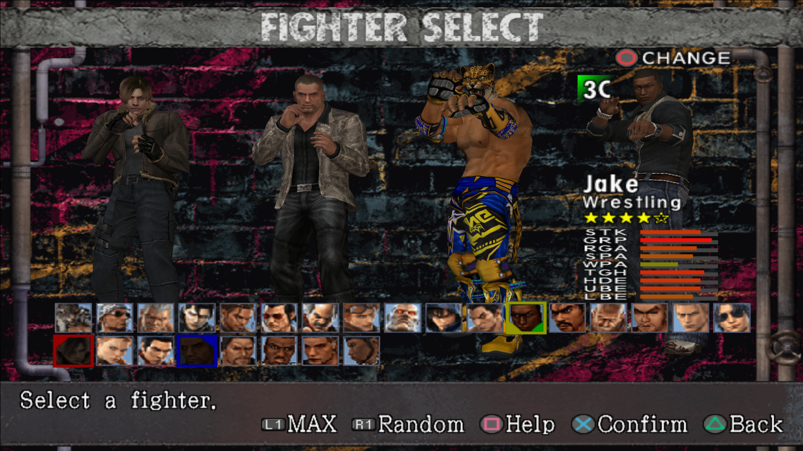
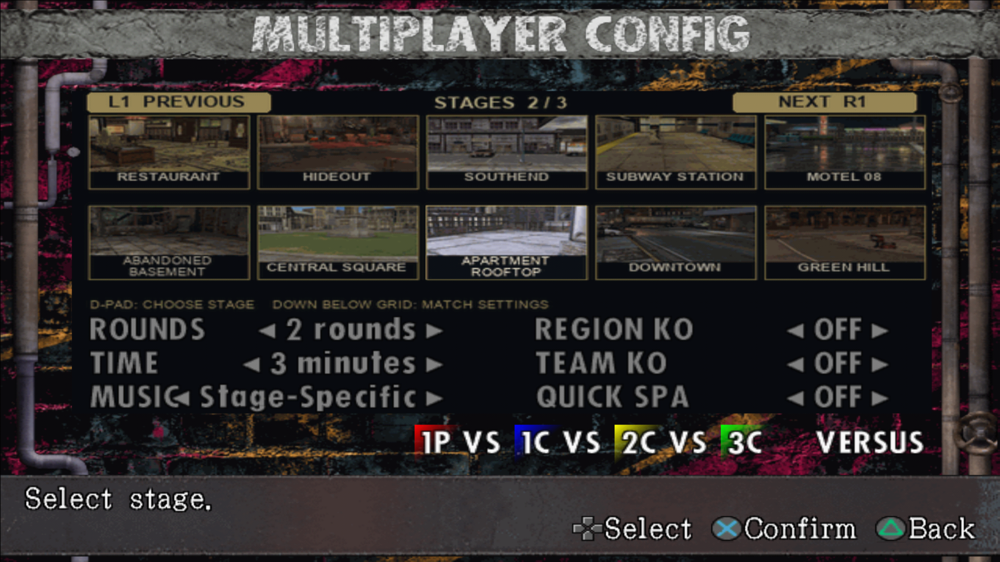

## October 3 update — 0.4 in validation

**0.4 is not yet a public download.** The installer below is still the September 30 build. The previous manual package was labelled 0.3 on Google Drive; the GitHub installer is tagged v0.2.0.

Changes prepared for the 0.4 candidate:

- New independent combat and announcer voice banks for **Baek, Nina and Carl Johnson**.
- Dedicated SPA and Fighter File recordings where supplied; heavy attack lines cover missing SPA lines, and taunts cover missing Fighter File lines.
- Audio-table repairs addressing incorrect sound assignments, including footsteps playing attack voices in Free Mode mission 5. Intermittent missing/duplicated sounds still need broader testing.
- Baek and Nina combat follow-ups: increased hitstun on selected later contacts, revised finishers and movement. Violet neutral/down timing and up-string movement, landing and kip-up revisions.
- Baek gi-trim UV repair and hair/belt swing corrections; returned model repairs integrated for Violet, Paul, Nina and Carl Johnson.
- New selection portraits for Baek, Paul, Kazuya, Nina and Carl Johnson.
- Experimental healthbar skin rolled back.

**Public roster:** Jeff, Snake, Vergence, Devil Jin and Renamon will be left out of 0.4 while unfinished.

**Before release:** verify fresh-boot voice playback (including SPA and Fighter File), sound assignments and roster navigation; finish and verify the manual **0.4 + Textures** package and download link. Final patch notes since the 0.3 manual release will accompany the package. Paul hair/texture polish and remaining model cleanup are deferred; Nina mouth animation and reported UV issues still need follow-up.

These are candidate changes, not final release validation. Start changed builds from a fresh boot: old emulator save states can restore old sound tables and other data.

---

**[Click here to download Auto-Installer.exe](https://github.com/Jasonafex/urban-reign-redux/releases/latest/download/Auto-Installer.exe)** · **[Picture guide](https://jasonafex.github.io/urban-reign-redux/install/)**

    

# Urban Reign Redux

More fighters, more multiplayer stages, new music and menus for Urban Reign. A community project by **Jasonafex**.

**September 30 update:** Downloads now include the Trial 13 combat and character fixes. Existing players should run the latest installer again, then rebuild from their supported original game or original backup. [Patch notes](docs/patch-notes/2026-09-29-combat-playtest.md).

## Install in three steps

1. **Download and run Auto-Installer.exe.** The **55 MB installer** includes Mod Manager. Keep the defaults to play, or use **Advanced** to choose individual characters. Editor is last and unchecked by default.
2. **Choose your PCSX2 program folder.** Setup finds its Documents/OneDrive data folder and installs the required memory patch, runtime files and HD textures automatically. Keep PCSX2 closed during installation.
3. **Open Redux Mod Manager.** Choose your supported original Urban Reign ISO, keep **Overwrite** and **Redux 0.2 Collection** selected, then click **Apply selected mods**. Open the patched ISO in PCSX2 from a fresh boot.

**Downloads are automatic. No ZIP extraction or manual file copying.** Default textures and intro are required; only selected characters, music and Editor are downloaded. Desktop shortcuts are offered; starting with Windows is optional. The picture guide is included in the installer and available from Mod Manager.

You need an internet connection for setup, Windows 64-bit, PCSX2 with ExtraMemory support, and your own supported Urban Reign ISO. PCSX2 and the game are not included. The release was tested with PCSX2 2.7.403. Open PCSX2 once and close it before running setup.

## See what is included

[Explore the screenshots and full project rundown](https://jasonafex.github.io/urban-reign-redux/) · [Changes and known issues](CHANGELOG.md) · [Report an issue](https://github.com/Jasonafex/urban-reign-redux/issues)

Version **0.2 Alpha** includes the expanded roster and stages, camera/HUD improvements, and a mouth-animation pilot for Leon, Cammy and Violet. Violet's shirt/gloves and Marduk's waist/underarms still have deformation issues. See the changelog for the complete list.

The optional Editor is for creating or changing mods. Players only need Mod Manager and Mods.

This repository hosts the release, website and setup support. It does not include the editor's complete source. No blanket license is granted to third-party game or character assets. Not affiliated with or endorsed by the original game's publisher.

### Game compatibility and support

Use a supported USA or verified Deluxe image. USA CHD converts automatically and is kept unchanged. Europe and Japan are not supported. If setup or building fails, use **Support logs** in Mod Manager (or click the installer error) and share the latest log.
