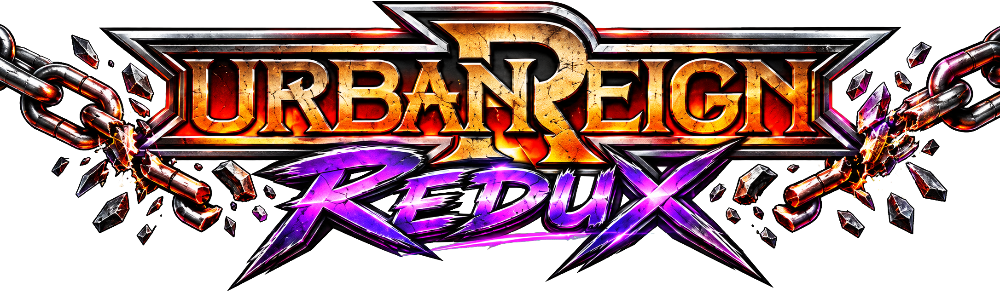

# Urban Reign Redux 0.4

More fighters, revised movesets, new voices, music and menus for Urban Reign. A community project by **Jasonafex**.

## Download

**[Download 0.4 + Textures — complete manual package, 1.75 GB](https://drive.google.com/file/d/127deHyx4wlYcyniWvTe1pl8oEXROJMxh/view)**

[Full patch notes since 0.3 and checksums](https://github.com/Jasonafex/urban-reign-redux/releases/tag/v0.4.0) · [Project website](https://jasonafex.github.io/urban-reign-redux/) · [Report an issue](https://github.com/Jasonafex/urban-reign-redux/issues)

Released October 3, 2026. The Google Drive download is available to anyone with the link; no sign-in is required.

The ZIP includes:
- Urban Reign Redux 0.4.iso
- 167 matching replacement textures
- PCSX2 ExtraMemory game setting
- START HERE.txt, patch notes and SHA-256 checksums

Supply your own PCSX2 installation and BIOS. **No mod installer or Editor is required.** The earlier September 30 Auto-Installer does not install this 0.4 build.

## Manual setup

1. Extract the ZIP, read **START HERE.txt**, and put the new ISO in your games folder.
2. Close PCSX2. Merge the supplied game setting into its data folder and install the included textures. Back up older Redux texture packs outside the active texture folder to avoid conflicts. Enable **Load Textures**.
3. **Fresh-boot the new ISO. Do not resume an older emulator save state.** Memory-card saves may still be used.

This is the USA SLUS-21209 build. PCSX2 must support ExtraMemory; tested with PCSX2 2.7.403.

## What's new since 0.3

- Independent Baek, Nina and Carl Johnson combat/announcer banks; new SPA and Fighter File recordings with heavy-attack/taunt fallbacks.
- Expanded voice-table and sound-routing repairs, added stream loading fixes, and SPA voice admission corrections.
- Nina and Baek moveset revisions, stronger later-string hitstun, updated finishers, throws and SPAs.
- Hwoarang right stance and purple SPA3; Violet timing, movement and kip-up corrections; Cammy/Heihachi throws and further combat/grab recovery fixes.
- Updated Violet, Paul and Nina models, Carl Johnson face repair, Baek gi-trim UV/swing fixes, and new selection portraits.
- Experimental healthbar skin reverted.

See the [complete release notes](https://github.com/Jasonafex/urban-reign-redux/releases/tag/v0.4.0) for character-specific changes. Some model UV/shading defects, Nina's speaking animation and side-string follow-through remain; audible playback and scene-transition testing are not exhaustive.

## About

[Explore the project and screenshots](https://jasonafex.github.io/urban-reign-redux/) · [Release history](CHANGELOG.md)

This repository hosts the release, website and setup support. It does not include the editor's complete source. No blanket license is granted to third-party game or character assets. Not affiliated with or endorsed by the original game's publisher.
